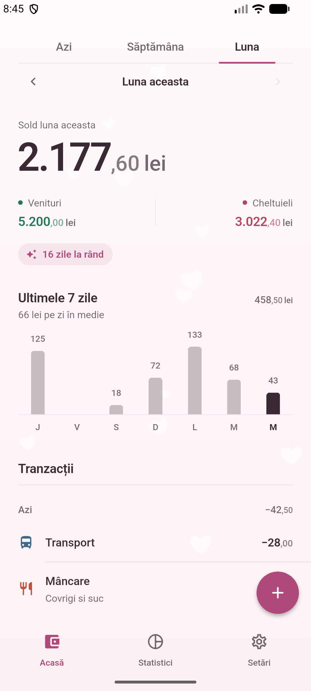
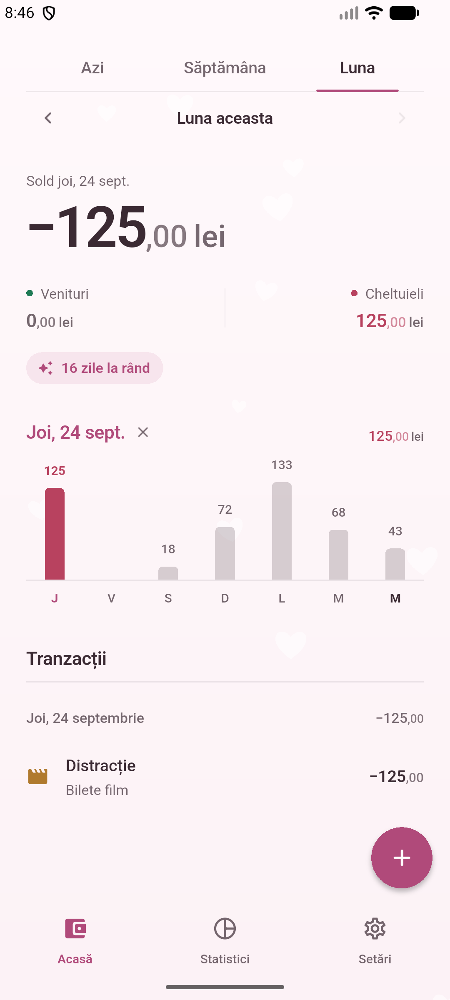
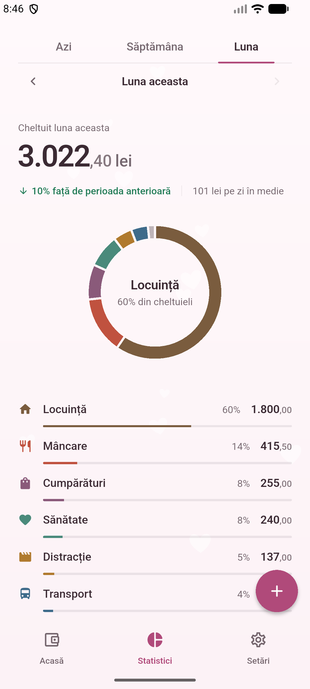
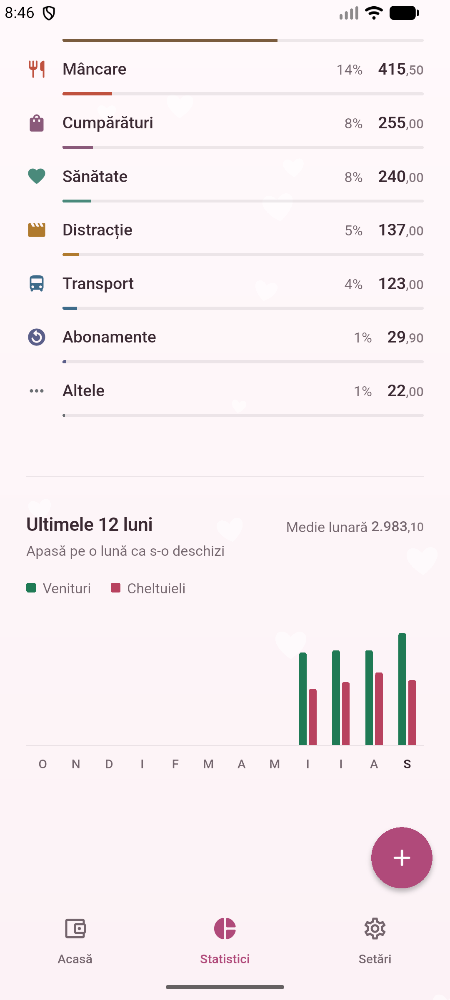
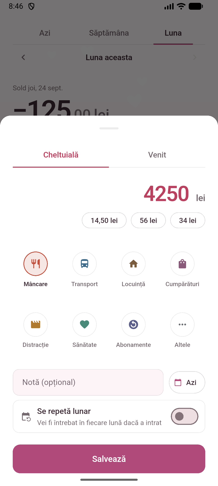
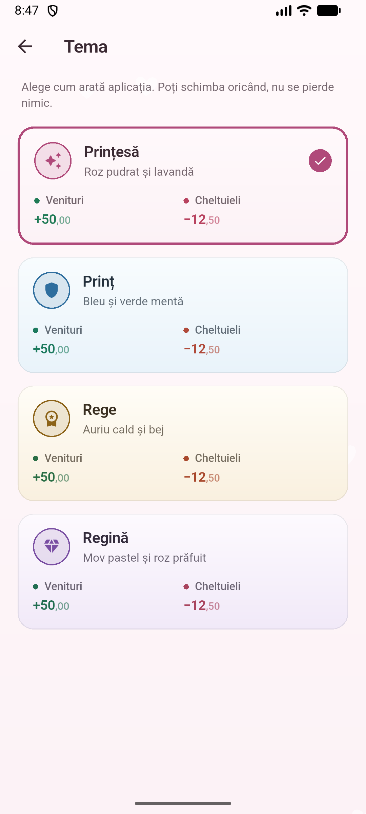
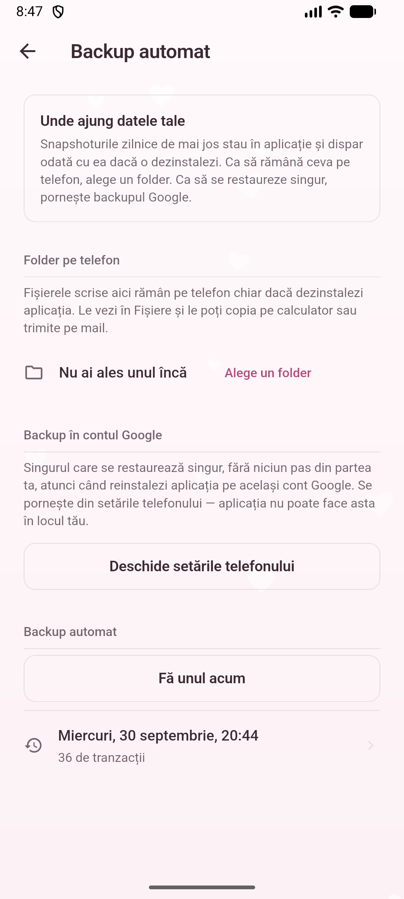

<div align="center">

# 🐷 Tally

**Un jurnal de cheltuieli pentru copii, care arată ca al lor.**

Construit în Flutter, cu datele ținute exclusiv pe telefon — fără cont, fără
server, fără internet.

[](https://flutter.dev)
[](https://dart.dev)
[](https://developer.android.com)
[](#-cum-funcționează)
[](LICENSE)

</div>

---

## ✨ De ce încă o aplicație de cheltuieli

Pentru că aproape toate sunt făcute pentru adulți: gri, dense, și cu o
problemă pe care nimeni nu o rezolvă — **a nota o cheltuială nu are nicio
răsplată**. Banii s-au dus deja, numărul care apare e mai mic decât cel
dinainte, și nu se întâmplă nimic bun. Un adult duce obiceiul mai departe și
fără asta. Un copil, de obicei, nu.

Tally dă pagina în mâna copilului — patru teme între care alege el — și pune
jumătate de secundă de confetti exact în momentul în care apasă „Salvează".
Restul e un jurnal de cheltuieli serios, cu aritmetica făcută corect.

<div align="center">

| Acasă | O zi, scoasă din grafic | Statistici | Ultimele 12 luni |
|:---:|:---:|:---:|:---:|
|  |  |  |  |

| Adăugare | Teme | Backup |
|:---:|:---:|:---:|
|  |  |  |

</div>

---

## 🎯 Funcții

| | |
|---|---|
| 👑 | **Patru teme** — Prințesă, Prinț, Rege, Regină. Schimbă pagina întreagă: degradeu, accent, și forma temei presărată în fundal |
| 🎉 | **Confetti la salvare** — inimi, stele, coroane sau diamante, după tema aleasă |
| 🔥 | **Zile la rând** — câte zile consecutive ai notat ceva. Apare doar când există o serie, și nu ceartă niciodată când se rupe |
| 📊 | **Grafic pe zile** — apeși o bară și intri în ziua aia: soldul și lista se îngustează la ea, graficul rămâne pe loc |
| 🍩 | **Pe ce se duc banii** — inel plus clasament pe categorii, cu procente |
| 📅 | **Ultimele 12 luni** — venituri și cheltuieli una lângă alta; apeși o lună și aplicația se mută acolo |
| 🔁 | **Plăți recurente** — salariu, chirie, abonamente. Aplicația **întreabă** dacă au intrat, nu presupune |
| 💾 | **Backup automat** — snapshot zilnic în aplicație, plus un folder ales de tine care supraviețuiește dezinstalării |
| 📤 | **Export** — CSV pentru Excel, JSON pentru refacere completă |
| 🔌 | **Complet offline** — fără cont, fără internet, fără reclame, fără analytics |

---

## 🧠 Cum funcționează

### Banii sunt numere întregi

Fiecare sumă e stocată în **bani, ca `int`** — niciodată `double`. Motivul e
că `0.1 + 0.2` nu dă `0.3` în virgulă mobilă, iar într-un registru contabil
asta înseamnă că totalurile lunare încetează să se potrivească după câteva
sute de rânduri. Virgula mobilă apare doar la margini: când parsezi ce a scris
omul și când desenezi pe ecran.

### Ecranul nu calculează nimic

```
          scrii o cheltuială
                  │
                  ▼
        SQLite (drift)  ──.watch()──►  Riverpod  ──►  ecran
                  │
                  ├──► snapshot zilnic, în aplicație
                  ├──► folder ales de tine, pe telefon
                  └──► Auto Backup, în contul Google
```

Un rând intră în SQLite, interogarea drift observă că tabela s-a schimbat și
lista nouă ajunge singură pe ecran. Nu există „reîmprospătare". Ecranele nu
fac aritmetică — o fac interogările și providerele, iar widget-urile doar
desenează.

### Zilele se grupează în Dart, nu în SQL

Funcția `date()` din SQLite rezolvă un timestamp **în UTC**. Pentru oricine nu
locuiește la Greenwich, o cheltuială făcută seara ar cădea pe ziua greșită în
grafic. Bug-ul a fost găsit pe un emulator, nu pe hârtie: bara de „azi"
apărea pe ziua de ieri. Gruparea se face acum în Dart, cu `toLocal()`.

### Cele trei plase de siguranță

Nu sunt redundante — fiecare acoperă altceva, și aplicația spune deschis care
ce acoperă.

| Plasă | Te apără de | Nu te apără de |
|---|---|---|
| **Snapshot zilnic**, în stocarea privată | ștergere greșită, restaurare greșită, un bug | dezinstalare |
| **Folder ales de tine** (Storage Access Framework) | dezinstalare, reinstalare | pierderea telefonului |
| **Auto Backup Google** | pierderea telefonului; se restaurează singur | comutatorul fiind oprit din setările telefonului |

Snapshoturile se scriu **atomic** — într-un fișier `.part`, apoi mutat la
loc. Un snapshot se ia fix când aplicația trece în fundal, adică exact când
Android e cel mai dispus să omoare procesul; o scriere tăiată în două ar lăsa
un fișier trunchiat cu nume valid, care apoi ar scoate un snapshot bun din
rotație.

### Testele

**229 de teste**, care acoperă printre altele aritmetica lunilor la trecerea
dintre ani, contrastul fiecărei culori din fiecare temă la ambele capete ale
degradeului, migrarea bazei de date pe un fișier v1 real, și un bug care a
distrus date în timpul unui test pe emulator: alegerea folderului de backup
suprascria backupul bun cu starea goală de după reinstalare.

---

## 🛠️ Stack

**Flutter · Dart · Kotlin · SQLite**

| Pachet | Rol |
|---|---|
| [`drift`](https://pub.dev/packages/drift) | Baza de date, cu interogări reactive |
| [`flutter_riverpod`](https://pub.dev/packages/flutter_riverpod) | Starea aplicației |
| [`fl_chart`](https://pub.dev/packages/fl_chart) | Graficele pe zile, pe luni și inelul |
| [`intl`](https://pub.dev/packages/intl) | Formatare românească pentru date și sume |
| [`shared_preferences`](https://pub.dev/packages/shared_preferences) | Tema aleasă, moneda, ultimul backup |
| [`share_plus`](https://pub.dev/packages/share_plus) | Trimiterea exporturilor |
| [`file_picker`](https://pub.dev/packages/file_picker) | Alegerea unui backup de restaurat |
| [`path_provider`](https://pub.dev/packages/path_provider) | Unde stau baza de date și snapshoturile |

Partea nativă e un singur fișier Kotlin, [`BackupFolder.kt`](android/app/src/main/kotlin/com/robertgruescu/tally/BackupFolder.kt):
selectorul de folder și scrierea în el, prin `DocumentsContract`. Scris direct,
nu printr-un plugin — ambalajele existente peste SAF sunt subțiri peste
aceleași cinci apeluri și variat de nemenținute, iar o dependență abandonată
e o problemă într-un loc de care depind datele cuiva.

---

## 🚀 Rulare

```bash
flutter pub get
flutter run -d <id-dispozitiv>
```

Pentru un APK de release:

```bash
flutter build apk --release --split-per-abi
# rezultatul: build/app/outputs/flutter-apk/app-arm64-v8a-release.apk
```

> [!NOTE]
> `--split-per-abi` scade APK-ul de la 58 MB la ~20 MB. Fără el, în pachet
> intră bibliotecile native pentru toate cele trei arhitecturi.

> [!IMPORTANT]
> APK-ul se construiește momentan cu cheia de semnare de **debug**. Pentru
> publicare pe Play Store trebuie configurată o cheie proprie în
> `android/app/build.gradle.kts`.

---

## 🔐 Permisiuni

Aplicația nu cere **nicio** permisiune de sistem. Nu are nevoie.

| Ce ar cere alte aplicații | De ce Tally nu |
|---|---|
| **Internet** | Nu trimite nimic nicăieri |
| **Stocare** | Folderul de backup se alege prin selectorul sistemului, care acordă accesul doar la folderul ales |
| **Notificări** | Plățile recurente se verifică la deschiderea aplicației, nu printr-o alarmă de fundal |
| **Locație, contacte, cameră** | — |

Compromisul la plățile recurente e conștient: o regulă scadentă pe 5 e
observată la următoarea deschidere a aplicației, nu la miezul nopții. Pentru
un registru pe care nimeni nu-l citește la miezul nopții, nu e un compromis.

---

## ⚠️ Limitări cunoscute

- **Doar Android.** Partea nativă de backup (`DocumentsContract`, SAF) nu are
  echivalent pe iOS, iar restul n-a fost testat acolo.
- **Fără mod întunecat**, intenționat. Pastelurile coborâte spre negru
  încetează să fie pasteluri, iar degradeul și formele care dau caracterul se
  transformă în noroi. Aplicația rămâne luminoasă oricum e setat telefonul.
- **Categoriile sunt fixe** — douăsprezece, în română. Nu pot fi încă
  adăugate, redenumite sau șterse din aplicație.
- **Fără căutare** în tranzacții.
- **Doar în română.** Traducerea există ca fișier ARB, dar nu există decât o
  limbă.
- **Cheie de semnare de debug**, cum scrie mai sus.

---

## 📥 Descărcare

**[`Tally-v1.0.0.apk`](Tally-v1.0.0.apk)** — 20,6 MB, pentru telefoane
`arm64` (adică orice telefon Android din ultimii zece ani).

Variantele pentru celelalte arhitecturi se găsesc la
**[Releases](../../releases)**.

La instalare, Android va cere să permiți instalarea din surse necunoscute.
După aceea aplicația pornește direct — nu are ecran de întâmpinare, nu cere
cont și nu cere permisiuni.

> [!TIP]
> Primul lucru de făcut: **Setări → Backup automat → Alege un folder**.
> Durează cinci secunde și e singurul lucru care face ca datele să
> supraviețuiască dezinstalării aplicației.

---

## 📄 Licență

[MIT](LICENSE) — folosește codul cum vrei: copiază-l, modifică-l, publică-l.
Singura condiție este să păstrezi nota de copyright.

---

<div align="center">

Făcută pentru cineva care învață, abia acum, ce înseamnă să rămâi fără bani
înainte de sfârșitul lunii.

</div>
